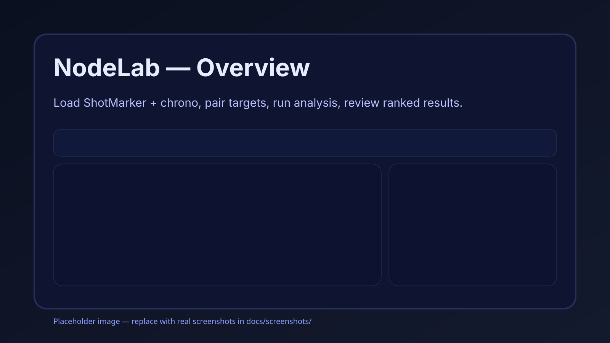
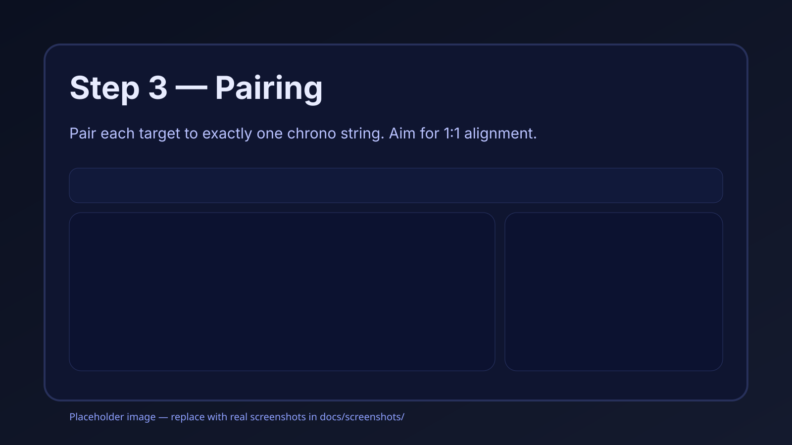

# NodeLab

NodeLab is a **standalone**, **single-file**, in-browser tool for pairing **ShotMarker** targets with **chronograph strings** and running node-confidence analysis — **fully locally**.

**No installs. No cloud. No accounts.** Your data stays on your machine.

## Run it
- **Live (GitHub Pages):** https://mrimp.github.io/NodeLab/
- **Offline:** download **`NodeLab_LATEST.html`** from this repo and double-click (Chrome/Edge recommended).

## What’s new in the ship-quality build
- **Offline hardening:** runtime blocks accidental network calls (fetch/XHR/WebSocket) and logs attempts.
- **Offline Self-Test panel:** confirms no external URLs, network APIs are blocked, and storage is working.
- **Portable mode:** export/import a single bundle that includes session data **plus** NodeLab settings.

## Quick start
1. Load ShotMarker file(s)
2. Load chrono file(s)
3. **Step 3:** Pair each target to exactly one chrono string
4. Run Analysis
5. Export JSON snapshot (filename includes ShotMarker name + timestamp)

## What it does
- Imports ShotMarker targets and identifies scored shots (sighters excluded from scoring)
- Loads chronograph files and maps them to targets via Step 3 pairing
- Produces ranked results with a confidence badge that **explains without dictating**
- Exports a JSON snapshot:
  `NodeLab_<SessionOrShotMarkerName>_<YYYY-MM-DD>_<HHMM>.json`

## Screenshots
These are representative UI screens. If you fork/customize the UI, update these.

- Overview (placeholder):
  
- Step 3 pairing (placeholder):
  
- Results (placeholder):
  

## Known limitations / browser notes
Some behaviors are browser + security-model specific (especially under `file://`).
See: **[docs/BROWSER_NOTES.md](docs/BROWSER_NOTES.md)**

## Offline reliability
Open **Offline reliability → Run Offline Self-Test**.
It checks for external URLs, confirms network APIs are blocked, and verifies storage.

## Portable mode (optional)
Use **Offline reliability → Export portable bundle** to export:
- Session data (targets, chrono strings, pairings, results)
- NodeLab settings stored in `localStorage`

Import it later with **Import portable bundle**.

## Privacy
NodeLab runs entirely in your browser.
**All parsing and analysis runs locally.**

## Issues / Support
When opening an issue, include:
- what file types you loaded (ShotMarker + chrono)
- the on-screen warning/error text
- a screenshot of Step 3 pairing + results

## Snapshot export format
NodeLab exports analysis results as versioned JSON snapshots for use with companion tools (e.g., BarrelTracker).

The export contract is defined here:
➡️ [docs/SNAPSHOT_SPEC.md](docs/SNAPSHOT_SPEC.md)

## Releases
Semantic versioning, tagging flow, and a release checklist:
➡️ [docs/RELEASE.md](docs/RELEASE.md)
